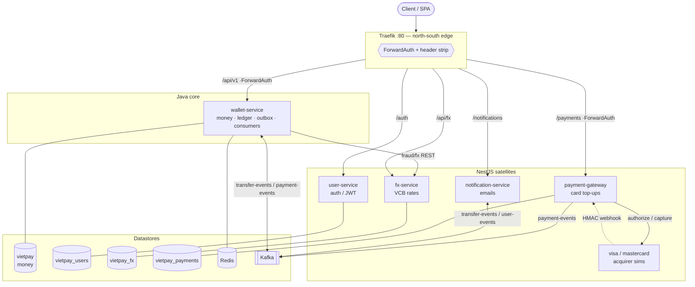
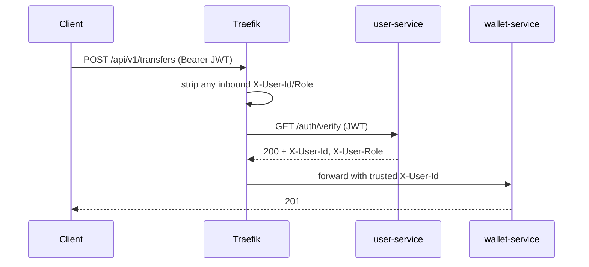
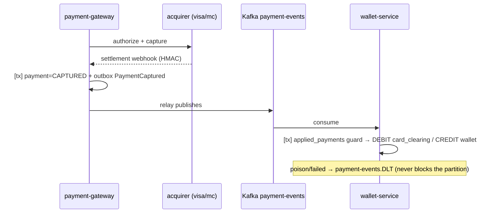

# Architecture

VietPay is a **polyglot microservices** system behind a single Traefik edge. The
**money core is Java/Spring Boot** (the part that must be provably correct); the
**satellites are NestJS** (auth, FX, notifications, card gateway, acquirer sims).
Each service owns its own database; services talk **synchronously over REST** for
request/response and **asynchronously over Kafka** (via a transactional outbox)
for facts that have already happened.

- Deep dives: [transfer flow](transfer-flow.md) · [card top-up](card-topup-flow.md) · [caching](caching.md) · [schema](schema/)

---

## 1. System topology



ASCII fallback:

```
                         Traefik (:80)  ── ForwardAuth ──┐
   /auth   /api/v1   /payments   /api/fx   /notifications │
     │        │          │          │            │        ▼
 user-svc  wallet-svc  gateway    fx-svc     notif-svc   (JWT → X-User-Id)
 (Nest)    (Java)      (Nest)     (Nest)     (Nest)
     │        │  ▲        │  ▲        │           │
   users    money │    payments│    fx_rates    (consumes Kafka)
    DB       DB   │      DB    │      DB
                  │            └── acquirer sims (visa/mastercard)
                  └────────── Kafka: transfer-events · payment-events · user-events
```

---

## 2. Services

| Service | Tech | Owns (DB) | Responsibility |
|---------|------|-----------|----------------|
| **wallet-service** | Java / Spring Boot | `vietpay` | Wallets, transfers, deposits, **double-entry ledger**, outbox producer, payment-events consumer — the graded core |
| **user-service** | NestJS / TypeORM | `vietpay_users` | Register/login/refresh/logout, issues ES256 JWT, ForwardAuth `/auth/verify` |
| **payment-gateway** | NestJS / TypeORM | `vietpay_payments` | `/payments` API, acquirer calls, webhook receiver, its own outbox → Kafka |
| **fx-service** | NestJS / TypeORM | `vietpay_fx` | Vietcombank rates (BullMQ cron) |
| **notification-service** | NestJS | — | Consumes Kafka events, sends emails |
| **visa / mastercard** | NestJS (shared `acquirer-sim`) | — | Simulated acquirers: authorize/capture + HMAC settlement webhook |

**Database-per-service.** No service reads another's tables. The only cross-service
links are REST calls and Kafka messages; e.g. `ledger_entries.payment_id` is a
**soft reference** to a payment that lives in the gateway's DB (no cross-DB FK).

---

## 3. The edge (Traefik, file provider)

One entry point on `:80`, path-routed. Protection is applied at the edge, not
duplicated in every service:

- **Public:** `/auth`, `/api/fx`, `/notifications`, `/swagger-ui`, `/v3/api-docs`, `/grafana`, `/prometheus`.
- **Protected (`forward-auth` + `strip-inbound-headers`):** `/api/v1`, `/payments`.
- **Blocked:** `/internal/**` (east-west only) → returns 403.



The JWT is validated **once, at the edge**; downstream services trust `X-User-Id`.
Client-supplied identity headers are stripped, so they can't be spoofed.

---

## 4. Money core — hexagonal (ports & adapters)

```
        ┌───────────────── api/ ──────────────────┐   controllers, DTOs, RFC-7807 errors
        │                    │                      │
        ▼                    ▼                      │
   ┌─────────── application/ ───────────┐           │   use cases + TRANSACTION boundary
   │ TransferService  ApplyPaymentSvc   │           │   (TransactionTemplate)
   └──────┬───────────────┬─────────────┘           │
          │ ports (interfaces, in domain/)          │
          ▼               ▼                          ▼
   ┌──────────────── domain/ ─────────────────────────┐  PURE — zero framework imports
   │ Wallet · Transfer · Money · LedgerEntry           │  business invariants live here
   │ Wallets · Transfers · Ledger · EventOutbox (ports)│
   └──────────────────────────────────────────────────┘
          ▲               ▲
          │ adapters implement the ports
   ┌────── infrastructure/ ───────────────────────────┐
   │ JPA repos (SELECT … FOR UPDATE) · Kafka outbox    │
   │ · Redis cache · Kafka consumer + DLQ              │
   └──────────────────────────────────────────────────┘
```

The **domain** layer has no Spring/JPA imports — the money rules read on their own.
The **application** layer owns the transaction boundary. **infrastructure** adapts
ports to Postgres/Kafka/Redis. Dependencies point inward (adapters depend on the
domain, never the reverse).

---

## 5. Synchronous money path (transfer)

Ordering is deliberate: idempotency replay and the fraud check (a **network** call)
run *outside* the transaction, so row locks are held briefly and never across a
network hop.

```
validate → idempotency replay? → ownership + currency checks → fraud check
   └─▶ TRANSACTION: lock both wallets (FOR UPDATE, id-ordered)
                    debit / credit  (CHECK balance>=0 backstop)
                    insert transfer (UNIQUE idempotency_key)
                    append ledger (DEBIT src / CREDIT dst)
                    insert outbox TransferCompleted
       COMMIT → evict cached balances → 201
```

Full detail + guarantees table: [transfer-flow.md](transfer-flow.md).

---

## 6. Asynchronous facts — transactional outbox → Kafka

No dual-write: the domain event is written to an `outbox_events` row **in the same
transaction** as the state change. A relay publishes PENDING rows to Kafka
(at-least-once) and marks them PUBLISHED. Consumers are idempotent.

**Transfer → notification:**
```
wallet-service [tx: ledger + outbox] → relay → Kafka transfer-events → notification-service → emails
```

**Card top-up (money in):**


Detail: [card-topup-flow.md](card-topup-flow.md).

---

## 7. Cross-cutting concerns

| Concern | How |
|---------|-----|
| **Idempotency** | `UNIQUE(idempotency_key)` on transfers / payments; replay the stored result. DB-authoritative, never Redis. |
| **Concurrency** | Pessimistic `SELECT … FOR UPDATE`, id-ordered (deadlock-safe) + `CHECK(balance>=0)`. |
| **Exactly-once consumption** | `applied_payments` guard written in the posting transaction. |
| **Reliable events** | Transactional outbox + relay (ShedLock single-writer). |
| **Poison messages** | Spring `DefaultErrorHandler` → retries then `*.DLT`. |
| **Caching** | Wallet read-model, cache-aside, 60s TTL, evicted on every movement ([caching.md](caching.md)). |
| **Security** | ES256 JWT, edge ForwardAuth, header stripping, ownership checks, HMAC webhooks, jti blacklist on logout. |
| **Observability** | Micrometer/Prometheus + Grafana dashboards, OpenTelemetry traces, structured JSON logs (MDC on the transfer path). |
| **Schema** | Migrations only (Flyway for Java, TypeORM `migrationsRun` for Nest) — no auto-create. |

---

## 8. Key design decisions

- **DB row lock, not a Redis distributed lock, on the money path.** The lock and
  the balance live in one transactional system, so the lock releases atomically
  with commit/rollback and can't desync. A Redis TTL is an independent clock that
  can let two workers double-spend. Redis is used only for the outbox relay's
  ShedLock leader election and the read-model cache — never to guard money.
- **Transactional outbox, not dual-write.** Publishing to Kafka inside the DB
  transaction is impossible to do atomically; the outbox makes "state changed" and
  "event emitted" one commit.
- **Database-per-service.** Independent schemas and migration lifecycles; cross
  boundaries are soft references, not FKs.
- **Polyglot split.** The graded, correctness-critical core is Java; everything
  else is NestJS where iteration speed matters more than the last 1% of guarantees.
- **Same-currency transfers only (for now).** Keeps the ledger provably balanced
  per currency; cross-currency FX is documented as the next step.
